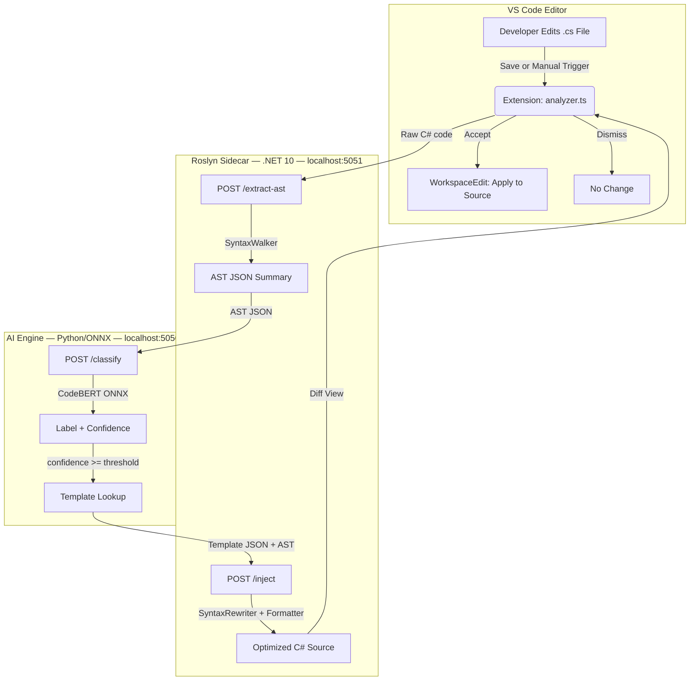

# Product Requirements Document: PerfPilot

**Version:** 1.1  
**Status:** Draft  
**Last Updated:** April 2026  

---

## 1. Executive Summary

**PerfPilot** is a local, air-gapped VS Code extension that helps C# developers write high-performance code — without requiring expert-level knowledge of advanced .NET 10 APIs.

Most performance problems in .NET applications share a small set of root causes: unnecessary heap allocations, synchronous I/O, scalar loops that could be vectorized, and missed concurrency primitives. PerfPilot detects these patterns automatically using a compact AI classifier, then produces guaranteed-compilable fixes using a Roslyn-based deterministic code engine.

The key design insight is a **strict separation of responsibilities**:

- The **AI model** only classifies *intent* (e.g., "this code is doing memory-intensive work"). It never generates code.
- The **Roslyn engine** produces the actual optimized output from expert-vetted templates. It never guesses.

This hybrid approach gives developers the convenience of AI assistance with the reliability of a rule-based system — eliminating the hallucination risk that makes general-purpose LLMs unsuitable for production code review.

---

## 2. Problem Statement

### 2.1 The Performance Knowledge Gap

Modern .NET 10 provides a rich set of high-performance APIs — `Span<T>`, `ArrayPool<T>`, `System.Threading.Channels`, `System.Runtime.Intrinsics` — but these APIs are genuinely difficult to use correctly. They require understanding of memory models, unsafe code, and concurrency semantics that most developers encounter only occasionally.

The result is a predictable pattern: developers write straightforward, readable code; that code ships to production; performance problems emerge at scale; and a specialist is brought in to optimize it after the fact. PerfPilot aims to shift this feedback loop earlier, into the editor.

### 2.2 Why Existing Tools Fall Short

| Tool Type | Limitation |
|---|---|
| General LLMs (e.g., ChatGPT, Copilot) | Non-compilable output, hallucinated APIs, no structural understanding of C# |
| Large local models (e.g., Gemma via Ollama) | 4–8 GB+ RAM, GPU often required, same hallucination risks |
| Static analyzers (e.g., Roslyn analyzers) | Rule-based only — cannot understand *intent*, only pattern-match known anti-patterns |
| Profilers (e.g., dotTrace, PerfView) | Post-hoc — require a running application, not useful during authoring |

PerfPilot occupies a gap none of these fill: **proactive, intent-aware, offline, and deterministic**.

---

## 3. Goals & Non-Goals

### Goals

| # | Goal | Success Metric |
|---|------|----------------|
| G1 | Detect performance intent from C# code without internet access | Classifier accuracy >= 85% on held-out test set |
| G2 | Produce always-compilable optimization suggestions | 100% of suggested code compiles against .NET 10 SDK |
| G3 | Run on a standard developer laptop with no GPU | Peak RAM < 500 MB; inference latency < 2 seconds |
| G4 | Integrate seamlessly into the VS Code editing flow | Trigger-to-diff shown in < 3 seconds end-to-end |
| G5 | Support 8 distinct performance intent categories at launch | All 8 categories covered with at least one template each |

### Non-Goals

- PerfPilot is **not** a general-purpose coding assistant. It will not answer questions, explain concepts, or generate code outside of its optimization templates.
- PerfPilot does **not** profile runtime behavior. It reasons about static code structure only.
- PerfPilot does **not** require or use an internet connection at any point during normal operation.
- PerfPilot does **not** support languages other than C# at this time.

---

## 4. Architecture

### 4.1 Overview

PerfPilot runs as three coordinated local processes, all spawned and managed by the VS Code extension:

```
+-----------------------------------------------------+
|                    VS Code Editor                   |
|  +-------------+        +-------------------------+ |
|  |  Extension  |<------>`|   Diff View (Accept /  | |
|  | (TypeScript)|        |   Dismiss)              | |
|  +------+------+        +-------------------------+ |
+---------|-------------------------------------------+
          |
    +-----v------------------------------------------+
    |              Roslyn Sidecar (.NET 10)           |
    |  +-----------------+  +---------------------+  |
    |  |  AST Extractor  |  |  Code Injector      |  |
    |  |  (SyntaxWalker) |  |  (SyntaxRewriter)   |  |
    |  +--------+--------+  +---------^-----------+  |
    +-----------|-----------------------|-------------+
                | Clean AST JSON        | Template + AST
    +-----------v-----------------------|-----------+
    |         AI Engine (Python/ONNX)   |           |
    |  +------------------+  +----------+---------+ |
    |  | Intent Classifier|  | Template Selector  | |
    |  |  (CodeBERT ONNX) |  |  (JSON lookup)     | |
    |  +------------------+  +--------------------+ |
    +-----------------------------------------------+
```

### 4.2 Component Breakdown

**VS Code Extension (TypeScript)**
- Listens for save events and manual triggers on `.cs` files
- Manages the lifecycle of the Roslyn sidecar and AI engine as child processes
- Renders the diff view and handles Accept / Dismiss actions

**Roslyn Sidecar (.NET 10 console app)**
- Exposes a local HTTP API on `localhost:5051`
- `POST /extract-ast`: Parses C# source into a structured JSON summary (methods, loops, allocations, async usage)
- `POST /inject`: Accepts an AST + template JSON, rewrites the original code using `CSharpSyntaxRewriter`, returns formatted source

**AI Engine (Python + ONNX Runtime)**
- Exposes a local HTTP API on `localhost:5050`
- `POST /classify`: Accepts an AST JSON summary, returns a performance intent label and confidence score
- `GET /health`: Used by the extension for startup readiness polling
- Model: fine-tuned CodeBERT exported to ONNX, runs CPU-only

**Template Library (JSON)**
- One file per intent label under `templates/`
- Each template specifies: `intent_id`, `before_example`, `after_template` (with `{PLACEHOLDER}` tokens), and required NuGet packages

### 4.3 Request Flow

```
1.  Developer saves a .cs file (or triggers manually via Command Palette)
2.  Extension sends selected code  --> Roslyn sidecar /extract-ast
3.  Roslyn returns structured AST JSON
4.  Extension sends AST JSON       --> AI engine /classify
5.  AI engine returns: { label: "Memory_Intensive", confidence: 0.94 }
6.  Extension fetches matching template from templates/{label}.json
7.  Extension sends AST + template --> Roslyn sidecar /inject
8.  Roslyn returns rewritten, formatted C# source
9.  Extension opens VS Code diff editor with Accept / Dismiss buttons
10. If accepted: WorkspaceEdit replaces the original selection in the file
```

---

## 5. Performance Intent Categories

PerfPilot recognizes 8 intent categories at launch:

| Label | Triggered By | Optimization Applied | Key .NET 10 API |
|---|---|---|---|
| `IO_Intensive` | Synchronous `File`, `HttpClient`, `SqlCommand` calls | Async pipeline with backpressure | `IAsyncEnumerable<T>` |
| `Memory_Intensive` | `new byte[]` or `new T[]` inside loops | Pooled buffer reuse | `ArrayPool<T>`, `MemoryPool<T>` |
| `Compute_SIMD` | Scalar numeric loops over arrays | Vectorized computation | `System.Runtime.Intrinsics` |
| `Concurrent_Throughput` | `ConcurrentQueue` or manual `lock` for queuing | Lock-free channels | `System.Threading.Channels` |
| `String_Processing` | `string.Substring`, `string.Split`, `+` concatenation | Zero-allocation slicing | `Span<char>`, `MemoryExtensions` |
| `Allocation_Heavy` | `new List<T>()` without capacity, frequent `Add` | Pre-sized or stack-allocated buffers | `stackalloc`, `CollectionsMarshal` |
| `Async_Stream` | `Task<List<T>>` returning batched results | Streaming async results | `IAsyncEnumerable<T>`, `await foreach` |
| `Buffer_Reuse` | `new MemoryStream()` created per-request | Recyclable stream pooling | `RecyclableMemoryStream` |

---

## 6. AI Model Design

### 6.1 Model Choice

PerfPilot uses **microsoft/codebert-base** as the backbone — a transformer pre-trained on code across multiple languages, including C#. The model is fine-tuned for 8-class classification using a labeled dataset of C# snippets.

This model is chosen over alternatives for three reasons:
- It is pre-trained on code, not natural language, so it understands token semantics like `new`, `await`, `Span`, and `lock` in context.
- At ~125M parameters before quantization, it is compact enough to export to a CPU-efficient ONNX graph.
- The fine-tuning task (intent classification) requires only the encoder, not a decoder — keeping inference fast and the model small.

### 6.2 Training Data

The dataset consists of approximately 4,000 labeled C# code snippets (500 per label), split 80/10/10 into train, validation, and test sets. Snippets are written to cover realistic but sub-optimal patterns — deliberately without the target optimization applied, since that is what the classifier will encounter in the wild.

### 6.3 Inference Pipeline

```
Raw C# source
     |
     v
Roslyn AST extraction  <-- structural features only, no raw tokens
     |
     v
AST JSON summary (methods, loops, allocations, async patterns)
     |
     v
CodeBERT tokenizer  (max_length=512)
     |
     v
ONNX Runtime inference  (CPU, ~150-400ms)
     |
     v
{ label: "...", confidence: float, all_scores: {...} }
```

The classifier operates on the **AST JSON summary**, not raw source code. This is an important design choice: raw source carries noise (variable names, comments, formatting) that can mislead a classifier. The AST summary strips this away, leaving only structural signal.

### 6.4 Confidence Threshold

Suggestions are only surfaced when `confidence >= 0.80` (configurable). Below this threshold, PerfPilot stays silent rather than suggesting a potentially wrong optimization.

---

## 7. Deterministic Code Generation

### 7.1 Why Templates, Not Generation

The most important architectural decision in PerfPilot is that **no AI model generates code**. All optimized code comes from Roslyn-rewritten templates authored and reviewed by .NET performance experts.

This gives three guarantees that no generative model can match:
1. **Compilability** — Templates are tested against the .NET 10 SDK. They always produce valid C#.
2. **Correctness** — Templates encode known-safe patterns. They do not hallucinate method signatures or misuse unsafe APIs.
3. **Auditability** — Any developer can read the template JSON to understand exactly what change is being proposed and why.

### 7.2 Template Structure

Each template is a JSON file with the following shape:

```json
{
  "intent_id": "Memory_Intensive",
  "description": "Replace heap-allocated arrays inside loops with pooled buffers",
  "before_example": "var buffer = new byte[4096]; // inside loop",
  "after_template": "var buffer = ArrayPool<byte>.Shared.Rent({SIZE});\ntry { {BODY} } finally { ArrayPool<byte>.Shared.Return(buffer); }",
  "substitutions": ["{SIZE}", "{BODY}"],
  "nuget": ["System.Buffers"]
}
```

### 7.3 Roslyn Rewriter

The `RoslynCodeInjector` uses `CSharpSyntaxRewriter` to traverse the original AST, identify the target node (e.g., a variable declarator with `new byte[]`), and replace it with the rendered template. Variable names and types are extracted from the original AST and substituted for `{PLACEHOLDER}` tokens before injection.

The output is passed through Roslyn's `Formatter` to ensure consistent indentation and style.

---

## 8. User Experience

### 8.1 Workflow

1. Developer writes or edits a `.cs` file in VS Code.
2. On save (or via `Ctrl+Shift+P -> PerfPilot: Analyze`), the selected method (or full file) is analyzed.
3. A status bar item shows `PerfPilot: Analyzing...` while processing.
4. If a high-confidence optimization is found, a diff editor opens automatically:
   - Left pane: original code (read-only)
   - Right pane: optimized code (read-only)
   - Bottom bar: **Apply Optimization** | **Dismiss** | **Why this change?**
5. Accepting the change writes it directly into the source file via `WorkspaceEdit`.
6. Dismissing closes the diff with no changes made.

### 8.2 "Why This Change?" Panel

Each suggestion links to a brief explanation (sourced from the template metadata) describing:
- What pattern was detected
- What API is being introduced
- What performance benefit is expected (e.g., "eliminates GC pressure from repeated byte[] allocations")

This serves an educational purpose alongside the practical one.

### 8.3 Extension Settings

| Setting | Type | Default | Description |
|---|---|---|---|
| `perfpilot.autoAnalyzeOnSave` | boolean | `true` | Trigger analysis automatically on file save |
| `perfpilot.confidenceThreshold` | number | `0.80` | Minimum classifier confidence to show a suggestion |
| `perfpilot.modelPath` | string | `"bundled"` | Path to a custom ONNX model (advanced) |
| `perfpilot.enableTelemetry` | boolean | `false` | Send anonymous usage stats (never sends code) |

---

## 9. Technical Constraints

| Constraint | Requirement |
|---|---|
| **Runtime** | .NET 10 SDK, Python 3.11+, Node.js 20+ |
| **Platform** | Windows, macOS, Linux (x64 and ARM64) |
| **Memory** | Peak RAM < 500 MB with both sidecars running |
| **Inference latency** | < 2 seconds per classification on a modern CPU |
| **Network** | Zero outbound network calls during normal operation |
| **Model size** | ONNX model <= 200 MB on disk |

---

## 10. Project Structure

```
perf-pilot/
├── extension/              # VS Code TypeScript extension
│   ├── src/
│   │   ├── extension.ts    # Activation, command registration
│   │   ├── sidecar.ts      # Child process lifecycle management
│   │   ├── analyzer.ts     # Trigger logic, API calls
│   │   └── diffView.ts     # Diff editor, Apply/Dismiss handling
│   └── package.json
│
├── roslyn-service/         # .NET 10 C# HTTP sidecar
│   ├── AstExtractor.cs     # SyntaxWalker -> JSON summary
│   ├── CodeInjector.cs     # SyntaxRewriter + Formatter
│   └── Program.cs          # Minimal HTTP listener
│
├── ai-engine/              # Python ONNX inference server
│   ├── server.py           # FastAPI app (/classify, /health)
│   ├── model/              # perf_pilot.onnx + label2id.json
│   └── training/           # Fine-tuning scripts
│
├── templates/              # One JSON file per intent label
│   ├── IO_Intensive.json
│   ├── Memory_Intensive.json
│   └── ...
│
└── data/                   # Labeled training dataset
    ├── train.jsonl
    ├── val.jsonl
    └── test.jsonl
```

---

## 11. Architecture Diagram (Mermaid)



---

## 12. Risks & Mitigations

| Risk | Likelihood | Impact | Mitigation |
|---|---|---|---|
| Classifier mislabels intent | Medium | Medium | Confidence threshold (0.80) filters low-certainty results; wrong-label suggestions are harmless since the diff is always reviewable before applying |
| Template does not match code structure | Low | High | Roslyn rewriter validates substitution tokens before injection; falls back to a "no suggestion" state rather than producing malformed code |
| ONNX model too slow on older hardware | Low | Medium | Async analysis does not block the editor; short snippets below a line threshold skip classification entirely |
| Sidecar process fails to start | Low | High | Extension shows a clear error in the Output Channel with diagnostic steps; degrades gracefully with a status bar warning |

---

## 13. Success Criteria

The project is considered complete when all of the following are true:

- [ ] End-to-end pipeline (save -> classify -> diff) works for all 8 intent categories
- [ ] Classifier achieves >= 85% accuracy on the held-out test set
- [ ] 100% of injected code snippets compile against the .NET 10 SDK
- [ ] End-to-end latency (trigger to diff shown) is < 3 seconds on a standard developer laptop
- [ ] The packaged `.vsix` installs and runs on Windows, macOS, and Linux without additional setup