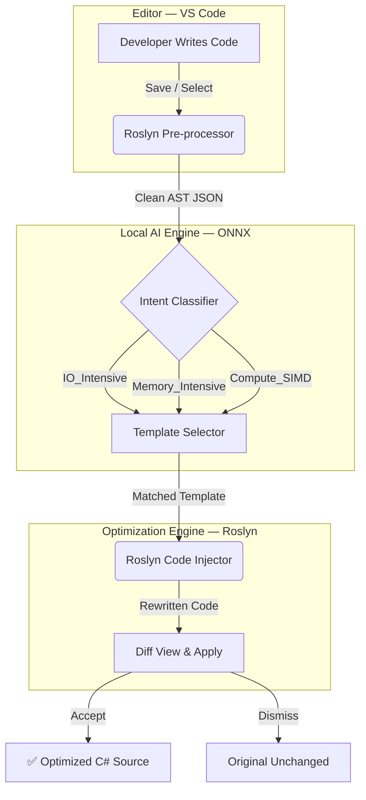

# ⚡ PerfPilot

> A local, air-gapped AI assistant that detects performance bottlenecks in C# code and suggests production-ready .NET 10+ optimizations — deterministically, without hallucination.

[](https://github.com/kobylev/Final_project/actions)
[](LICENSE)
[](https://marketplace.visualstudio.com)
[](https://dotnet.microsoft.com)

---

## What is PerfPilot?

PerfPilot is a **VS Code extension** built for C# developers working in performance-critical environments. It combines a **compact AI classifier** (15M–50M parameters, runs entirely on CPU) with a **Roslyn-powered deterministic code engine** to identify sub-optimal patterns in your code and inject expert-vetted, high-performance alternatives.

Unlike general-purpose AI coding assistants, PerfPilot never guesses. The AI's only job is to understand *what you're trying to do* — the actual code it suggests is produced by a rule-based Roslyn engine from pre-audited templates. The result is always compilable, always idiomatic, and always correct.

---

## The Problem

High-performance .NET development requires deep knowledge of advanced APIs that most developers reach for only rarely:

- `Span<T>` and `Memory<T>` for zero-allocation memory access
- `ArrayPool<T>` and `MemoryPool<T>` to eliminate heap pressure
- `System.Threading.Channels` for high-throughput producer-consumer pipelines
- `System.Runtime.Intrinsics` (SIMD) for vectorized compute
- `IAsyncEnumerable` for backpressure-aware async streams

General LLM assistants can *mention* these APIs, but they frequently produce non-compilable code, miss the nuances of safe usage, or hallucinate method signatures. In production systems, this is unacceptable.

---

## Goals

| # | Goal | Description |
|---|------|-------------|
| 1 | **Air-gapped operation** | Runs fully offline — no data leaves the developer's machine. Suitable for secure and regulated environments. |
| 2 | **Deterministic code output** | AI classifies intent; Roslyn templates produce the code. No free-form generation, no hallucination risk. |
| 3 | **Performance intent detection** | Automatically identifies whether a code block is compute-heavy, I/O-heavy, allocation-heavy, etc. |
| 4 | **Low resource overhead** | Designed for normal developer machines — CPU-only inference, minimal RAM footprint. |
| 5 | **Deep .NET 10+ specialization** | Purpose-built for modern C# performance patterns, not a general-purpose assistant. |

---

## How It Works

```
1. Trigger       →  Developer saves a .cs file or selects a code block in VS Code
2. AST Extract   →  Roslyn parses the block into a clean syntax tree (no heuristics)
3. Classify      →  Local ONNX model classifies the intent: e.g., "IO_Intensive"
4. Template Map  →  The intent label is matched to a pre-vetted optimization template
5. Inject        →  Roslyn rewrites the original code using the selected template
6. Review        →  A side-by-side diff appears in VS Code — developer accepts or dismisses
```

---

## Architecture



---

## Supported Optimizations

| Intent Label | Detected Pattern | Suggested Optimization |
|---|---|---|
| `IO_Intensive` | Synchronous file/network reads | `IAsyncEnumerable`, async pipelines |
| `Memory_Intensive` | `new byte[]` inside loops | `ArrayPool<T>`, `MemoryPool<T>` |
| `Compute_SIMD` | Scalar loops over numeric arrays | `System.Runtime.Intrinsics` (SIMD) |
| `Concurrent_Throughput` | `ConcurrentQueue` / manual locking | `System.Threading.Channels` |
| `String_Processing` | `string.Substring` / `string.Split` | `Span<char>`, `MemoryExtensions` |
| `Allocation_Heavy` | `List<T>` with known capacity | Pre-sized collections, `stackalloc` |
| `Async_Stream` | Batched async results | `IAsyncEnumerable<T>` |
| `Buffer_Reuse` | `new MemoryStream()` per request | `RecyclableMemoryStream` |

---

## Why Not Just Use a General LLM?

| Capability | General LLM (Gemma / Ollama) | PerfPilot |
|---|---|---|
| Compilable output | ❌ Not guaranteed | ✅ Always (Roslyn templates) |
| Air-gapped operation | ⚠️ Possible but large model | ✅ Compact ONNX, CPU-only |
| .NET 10 API accuracy | ⚠️ Hit or miss | ✅ Expert-audited templates |
| Proactive analysis | ❌ Completion only | ✅ Triggered on save |
| Memory footprint | ❌ 4–8 GB+ RAM | ✅ < 500 MB |
| Hallucination risk | ❌ High for niche APIs | ✅ None (deterministic engine) |

---

## Project Structure

```
perf-pilot/
├── extension/          # VS Code TypeScript extension
├── ai-engine/          # Python FastAPI + ONNX inference server
├── roslyn-service/     # .NET 10 C# sidecar (AST extractor + code injector)
├── templates/          # JSON optimization templates (one per intent label)
└── data/               # Labeled C# training dataset
```

---

## Tech Stack

- **VS Code Extension API** (TypeScript) — UI, diff view, commands
- **Microsoft.CodeAnalysis.CSharp** (Roslyn) — AST parsing and code rewriting
- **CodeBERT** fine-tuned → **ONNX Runtime** (CPU) — intent classification
- **FastAPI + Uvicorn** — local inference server
- **.NET 10** — Roslyn sidecar process

---

## Status

This project is under active development as a final project for an AI engineering course.

| Component | Status |
|---|---|
| Roslyn AST Extractor | 🔲 In progress |
| Intent Classifier (training) | 🔲 In progress |
| ONNX Inference Server | 🔲 In progress |
| VS Code Extension Shell | 🔲 In progress |
| Template Library (8 labels) | 🔲 In progress |
| End-to-end Integration | 🔲 Planned |

---

## License

MIT © 2026 — See [LICENSE](LICENSE) for details.